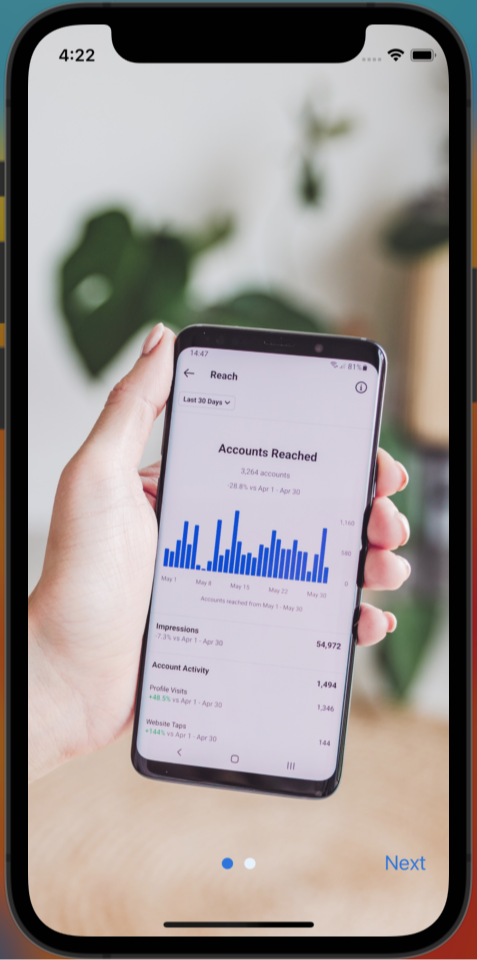

# Onboarding Swiper for React Native

A smooth and customizable onboarding swiper/slider for your React Native applications.

|  |  |
| -------------------------------------- | -------------------------------------- |

## Features

- Horizontal swipe to navigate between slides.
- Customizable buttons for navigation.
- Supports both text and custom React components for navigation buttons.
- Customizable styles for title, description, and image.
- Indicator dots to represent the slide position.

## Installation

```bash
npm install react-native-onboard-component
```

Or using yarn:

```bash
yarn add react-native-onboard-component
```

## Usage

Here's a basic example of how to use the Onboarding Swiper:

```jsx
import OnboardingSwiper from 'react-native-onboard-component';

const slidesData = [
  {
    image: require('./path-to-image1.png'),
    title: 'Welcome',
    description: 'Description for first slide.',
  },
  // ... Add more slides as needed.
];

function App() {
  return (
    <OnboardingSwiper
      data={slidesData}
      onDone={() => {
        console.log('Onboarding completed!');
      }}
    />
  );
}

export default App;
```

## Props

Here's a list of all the available props:

| Prop                 | Type                  | Description                                             | Default      |
| -------------------- | --------------------- | ------------------------------------------------------- | ------------ |
| data                 | Array of SlideData    | The data for the slides.                                | **Required** |
| deactiveColor        | string                | The color of the inactive dots.                         | '#e8f1fe'    |
| activeColor          | string                | The color of the active dot.                            | '#2871e3'    |
| onDone               | function              | Callback fired after the onboarding is completed.       | None         |
| nextLabel            | string OR ReactNode   | Label for the 'Next' button.                            | 'Next'       |
| doneLabel            | string OR ReactNode   | Label for the 'Done' button.                            | 'Done'       |
| bottomContainerStyle | StyleProp<ViewStyle>  | Custom style prop for the button container.             | None         |
| buttonColor          | string                | The color of the navigation button text.                | '#2871e3'    |
| titleStyle           | StyleProp<TextStyle>  | Custom style prop for the slide title.                  | None         |
| descriptionStyle     | StyleProp<TextStyle>  | Custom style prop for the slide description.            | None         |
| textContainerStyle   | StyleProp<ViewStyle>  | Custom style prop for the text container of each slide. | None         |
| imageStyle           | StyleProp<ImageStyle> | Custom style prop for the slide images.                 | None         |

## Important Note

For optimal display, the aspect ratio of images used should be 9:19, i.e., 1080x2280 pixels.

## License

MIT <!-- Assuming you're using the MIT license. You can replace this with your preferred license. -->
